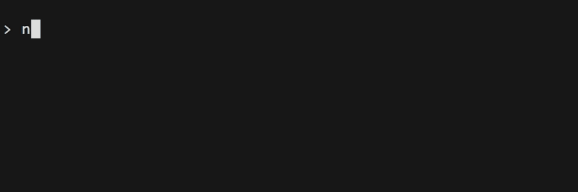

# snappet 
> store, manage and switch between your config settings easily

[](https://github.com/ad4mx/snappet/blob/main/LICENSE) [](https://www.npmjs.com/package/snappet) [](https://github.com/ad4mx/snappet/actions/workflows/node.js.yml) [](https://www.npmjs.com/package/snappet)



## 🔨 Install
You can install `snappet` through npx:
```bash
$ npx snappet <command> [options]
```

<b>Note</b>: Make sure you are using `npm` versions 16 and above for proper compatibility.

## ⚡ Usage

`snappet` simplifies the process of storing and managing your settings with *snapshots* - saved states of a file stored locally that can be accessed at any time. This approach can be particularly useful for managing config files, where switching between different settings is common.

### Add
Start by adding a snapshot with the `add` command:
```bash
$ snappet add myOldConfig utils.lua
```
You can add more than one filepath:
```bash
$ snappet add myNewConfig plugins.lua utils.lua
```
`snappet` saves the current state of those files and stores them locally. 
### List
In order to see all your saved snapshots, use the `list` command:
```bash
$ snappet list
Saved snapshots:
    - myOldConfig: utils.lua
    - myNewConfig: plugins.lua, utils.lua
```
### Switch
If you want to switch between saved snapshots, use the `switch` command:
```bash
$ snappet switch myOldConfig
Switched to myOldConfig
  Files affected:
    - utils.lua
```
Switching snapshots restores files to the saved state of the selected snapshot.
For any cosmetic changes to take place, a terminal restart is required.

### Remove
In case you want to remove a snapshot, use the `remove` command:
```bash
$ snappet remove myNewConfig
```
You can also remove all snapshots with the `--all` flag.

```bash
$ snappet remove --all
```

## ❗ Disclaimer

<b>Please be aware that `snappet` is not designed as a backup solution for important files and documents.</b> All data is saved in a local `snapshots.json` file.

## 🚧 Contributing

Any contributions to this project are appreciated. If you have any ideas/suggestions/bug fixes, please open an [issue](https://github.com/ad4mx/snappet/issues) or a [pull request](https://github.com/ad4mx/snappet/pulls). If you like the project, mind [giving it a star](https://github.com/ad4mx/snappet) on Github.

## 📑 License

This package is licensed under the [MIT](./LICENSE) license.

